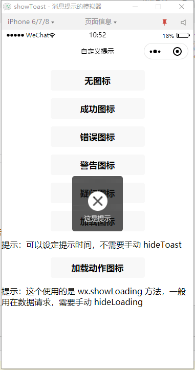

# 微信小程序 showToast 功能拓展

## 说明

针对 showToast 的功能拓展

提示图标拓展：none:无图标,error:错误,success:成功,warning:警告,question:疑问,loading:加载,load:加载动作

**注意：**

loading : 可以设定提示时间，不需要手动 hideToast

load : 这个使用的是 wx.showLoading 方法，一般用在数据请求，需要手动 hideLoading

## 示例

```js
showToast('这是提示','error',1200,true);
```

## 预览


